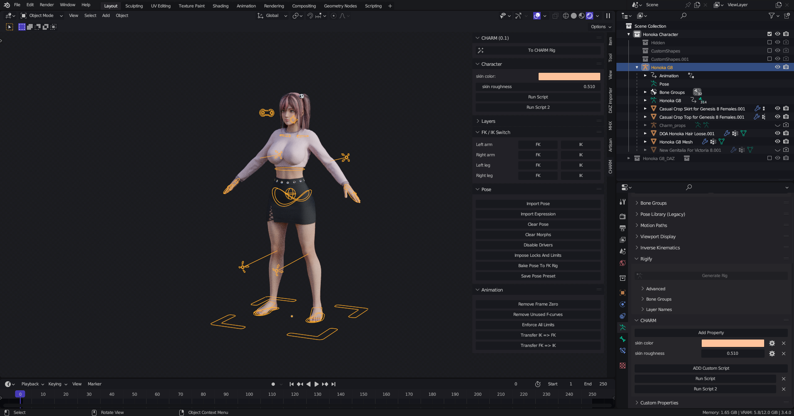

# CHARM Rigging

> Creado el 22/01/23 20:20

- CHARM es un simple addon que creé para agilizar mi flujo de trabajo usando el complemento Diffeomorphic.

- CHARM extrae operadores de "DAZ Importer" y "MHX" por lo que es necesario tenerlos instalados previamente, son funcionalidades que considero las más importantes.

- Un cambio de apariencia a los huesos para un ágil posado

- Un panel "Character" al que podemos añadir propiedades personalizadas para manejarlos como drivers y nuestros propios scripts que podremos ejecutar a un click.

- Un panel CHARM dentro de Armature Properties en donde añadiremos las nuevas propiedades e importaremos los nuevos scripts.

## Puesta en marcha
- Su armadura debe ser compatible con MHX
- Ejecute "To Charm Rig"
- Listo
> Su armadura tendrá una armadura hijo llamada "Charm_props" no la elimine y evite manipularlo.

## Uso del complemento
- Para añadir nuevas propiedades y scripts diríjase a Armature Properties, panel CHARM

- Para el resto de operaciones de los demás paneles lea su explicación en el texto flotante que aparece al tener el puntero sobre este.